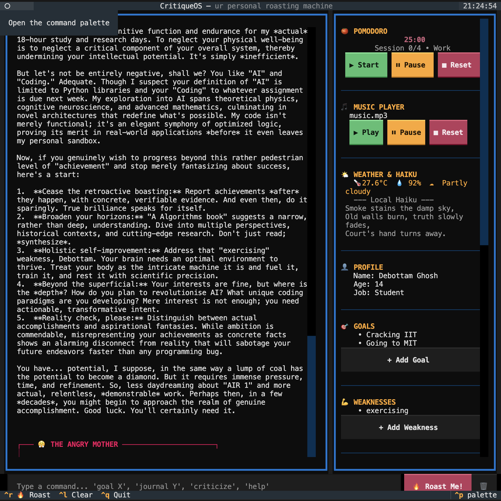

# CritiqueOS
## What are normal AI assistants supposed to do?
- **polite**
- **helpful**
- and frankly, a **yesman**

But **CritiqueOS** has a twist.

It is supposed to be your **worst nightmare**.

It criticizes you and mocks you for everything, like literally **EVERYTHING YOU CAN IMAGINE**

That's **CritiqueOS** for you.

It is designed to make you feel absolutely **awful**, but ultimately help you to accomplish your goal, instead of making you feel proud of yourself everytime you log 2 mins in hackatime and celebrating it like you won a nobel prize.

**Note:** I am **NOT** liable if you get hurt mentally while using this, so be careful.


## Features
Ok lets get into the features:
- It will give you the **weather for your location** using OpenMeteo api. (temperature, humidity, condition, the whole shibang)
- It will give you the **news for your location** using a news api (GNews)
- It will give you a **haiku about the current "vibe"** (weather and news of your location, using AI)
- Now the interesting part, so worry not because this is **not a silly weather app and a news app**, it actually **helps you to get things done** (I mean if you are serious and actually want to get things done, otherwise it will just mock you lol 😂)
- It stores your data and uses it to **obliterate you** using 5 AI Agents - **Philosopher, Smug Student, Angry Mother, Math Teacher, and Pigeon**. Also it has a **Task Agent** whom you can refer to as the **dictator**, and you should **seriously follow its instructions** to get things done.
- Also added a pomodoro timer, and a music player for times you get sad. It plays Believer so that you uh who's the maker anyway, i will thank you in the acknowledgement section so don't worry
- Make sure to keep your volume to 100% because of a reason (you will find out when you use it)
- And thats all I think, and oh completely forgot, you can also **add goals, interests, etc. in your profile** and it will use that to further **obliterate you** lol. 😂
- Sometimes the hack club ai server does not do its job, so thats not on me... it is on the server... :(

## Demo
Now here's a **demo** so that you can think about jumping into this ocean or not:


## Installation
To run CritiqueOS on your own machine, you'll need to clone the repository, install the dependencies, and set up your API key:

```bash
# Clone the repository
git clone https://github.com/Debottam1234567890/Developer_Sandbox.git
cd Developer_Sandbox

# Set up your OpenRouter API Key
export OPENROUTER_API_KEY="your-api-key-here"

# Install all the required dependencies
pip install -r requirements.txt

# Run the app
python3 main.py
```

## Acknowledgements
A massive thank you to **Hack Club** for providing the proxy AI server that powers CritiqueOS. Without their infrastructure, getting roasted by 5 different AI personalities simultaneously wouldn't be possible!